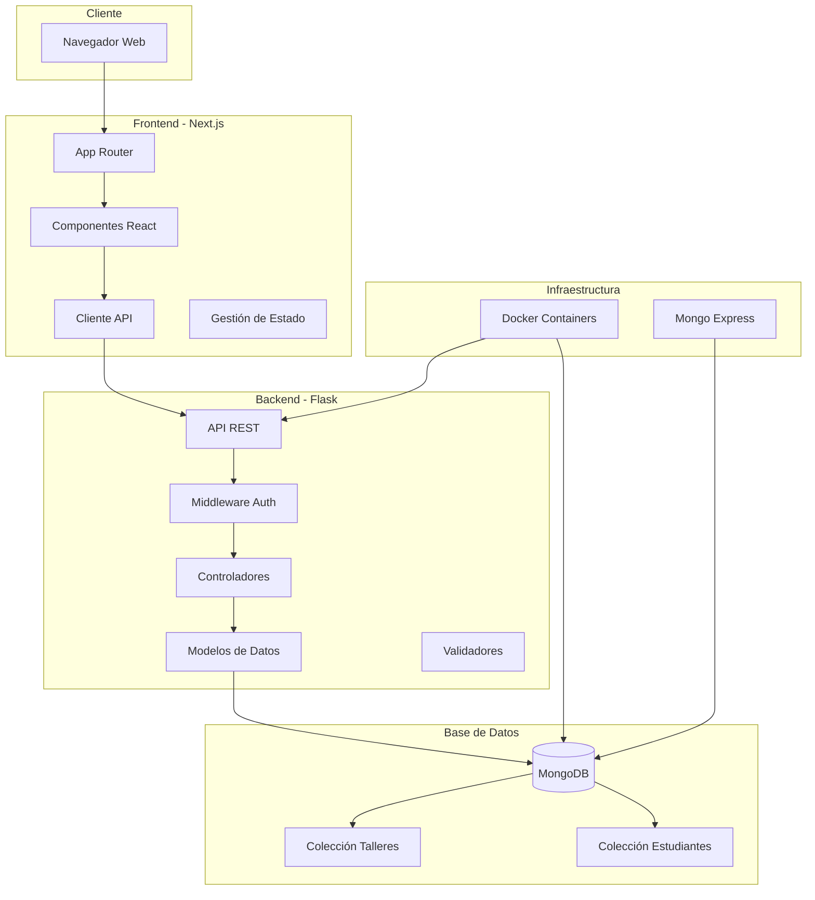
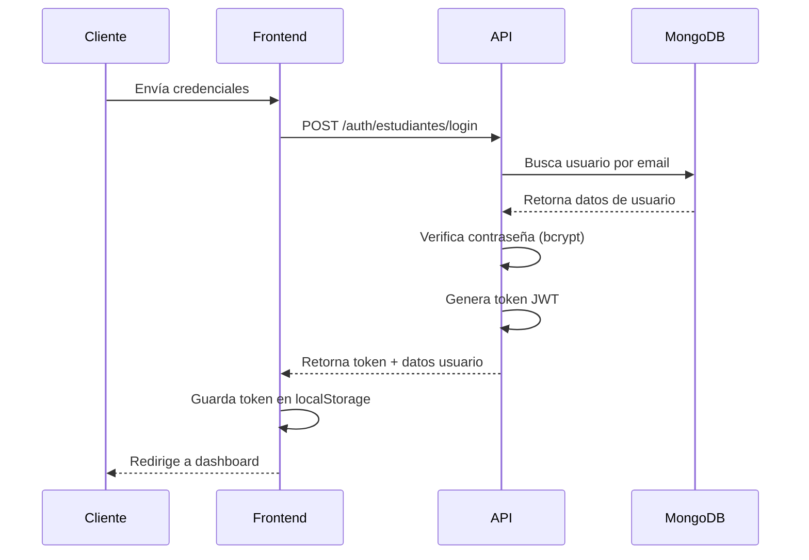
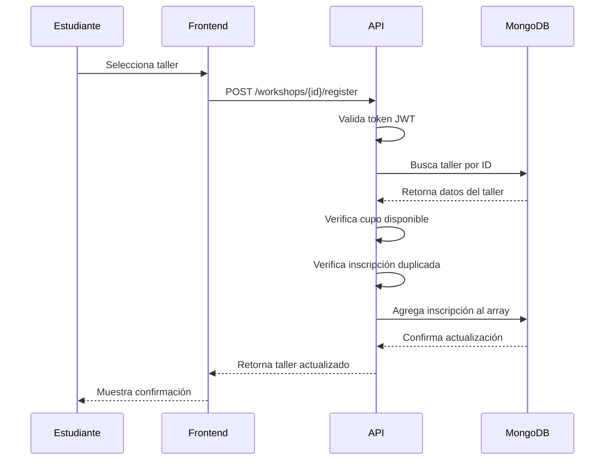
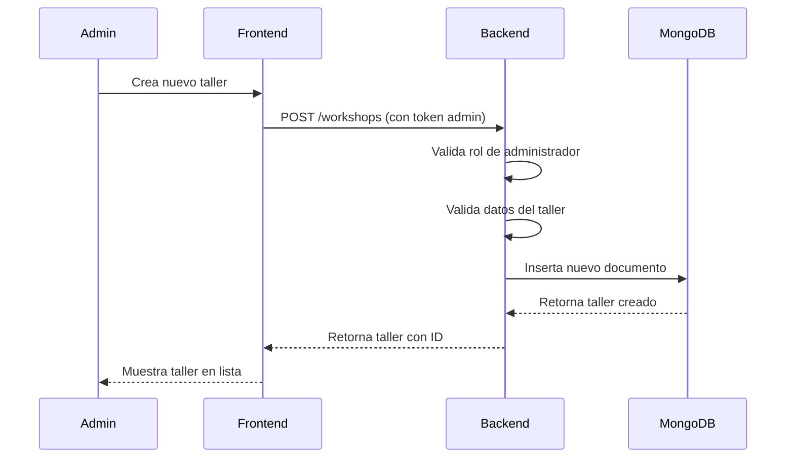

# Documentación Técnica - Arquitectura del Sistema

## Resumen de la Arquitectura

SkillsForge es un sistema de gestión de talleres construido con una arquitectura de microservicios que separa claramente el frontend del backend, permitiendo escalabilidad y mantenimiento independiente de cada componente.

## Arquitectura General



## Componentes Principales

### 1. Frontend (Next.js + TypeScript)

#### Tecnologías Clave
- **Next.js 15**: Framework React con App Router
- **TypeScript**: Tipado estático para mayor robustez
- **Tailwind CSS**: Framework CSS utilitario
- **Radix UI**: Componentes accesibles y personalizables

#### Estructura de Componentes
```
app/
├── layout.tsx              # Layout principal con providers
├── page.tsx                # Landing page
├── admin/                  # Panel administrativo
│   ├── layout.tsx          # Layout admin con autenticación
│   ├── page.tsx            # Dashboard principal
│   ├── login/              # Login de administrador
│   └── estudiantes/        # Gestión de estudiantes
└── estudiantes/            # Área de estudiantes
    ├── registro/           # Registro de nuevos usuarios
    ├── login/              # Login de estudiantes
    ├── talleres/           # Catálogo de talleres
    └── mis-registros/      # Inscripciones del usuario
```

#### Gestión de Estado
- **React Hook Form**: Formularios con validación
- **Zod**: Esquemas de validación
- **Local Storage**: Persistencia de tokens JWT
- **React Context**: Estado global de autenticación

### 2. Backend (Flask + Python)

#### Arquitectura de la API
```python
# Estructura modular del backend
app.py                      # Aplicación principal Flask
├── Configuración           # Variables de entorno y settings
├── Conexión MongoDB        # Cliente PyMongo con pooling
├── Middleware Auth         # Decoradores JWT para roles
├── Rutas Públicas          # Endpoints sin autenticación
├── Rutas Estudiantes       # Endpoints con auth de estudiante
├── Rutas Admin             # Endpoints con auth de admin
└── Manejo de Errores       # Handlers globales de errores
```

#### Patrones de Diseño Implementados

**1. Decorador de Autenticación**
```python
def requiere_admin(f):
    @wraps(f)
    def envoltura(*args, **kwargs):
        # Validación JWT y rol admin
        return f(*args, **kwargs)
    return envoltura
```

**2. Serialización de Datos**
```python
def serializar_taller(doc):
    # Transformación de documento MongoDB a JSON
    # Cálculo de cupos disponibles
    # Formateo de fechas y datos
    return formatted_data
```

**3. Manejo de Errores Centralizado**
```python
@app.errorhandler(404)
def not_found(error):
    return jsonify({"mensaje": "No encontrado"}), 404
```

### 3. Base de Datos (MongoDB)

#### Diseño del Esquema

**Colección: talleres**
```json
{
  "_id": "ObjectId",
  "nombre": "string",
  "descripcion": "string",
  "fecha": "YYYY-MM-DD",
  "hora": "HH:MM", 
  "lugar": "string",
  "categoria": "string",
  "tipo": "string",
  "instructor": "string",
  "rating": "number (0-5)",
  "cupo": "number",
  "creado_en": "ISO datetime",
  "actualizado_en": "ISO datetime",
  "inscripciones": [
    {
      "estudiante_id": "string",
      "nombre": "string",
      "email": "string", 
      "registrado_en": "ISO datetime"
    }
  ]
}
```

**Colección: estudiantes**
```json
{
  "_id": "ObjectId",
  "nombre": "string",
  "email": "string (único)",
  "hash": "string (bcrypt)",
  "creado_en": "ISO datetime"
}
```

#### Índices Optimizados
```javascript
// Índices para rendimiento
db.talleres.createIndex({"fecha": 1, "hora": 1})  // Búsquedas por fecha
db.talleres.createIndex({"categoria": 1})          // Filtros por categoría
db.estudiantes.createIndex({"email": 1}, {unique: true})  // Email único
```

## Flujo de Datos

### 1. Autenticación de Usuario



### 2. Inscripción a Taller



### 3. Gestión de Talleres (Admin)



## Seguridad

### 1. Autenticación JWT

**Generación de Tokens**
```python
payload = {
    "sub": user_id,
    "rol": "estudiante|admin", 
    "email": user_email,
    "exp": datetime.utcnow() + timedelta(hours=8)
}
token = jwt.encode(payload, JWT_SECRET, algorithm="HS256")
```

**Validación de Tokens**
```python
try:
    payload = jwt.decode(token, JWT_SECRET, algorithms=["HS256"])
    # Verificar rol y permisos
except jwt.ExpiredSignatureError:
    return error_response("Token expirado")
```

### 2. Hashing de Contraseñas

```python
from werkzeug.security import generate_password_hash, check_password_hash

# Al registrar
hash_password = generate_password_hash(password)

# Al autenticar  
is_valid = check_password_hash(stored_hash, provided_password)
```

### 3. Validación de Datos

**Backend (Python)**
```python
# Validación de campos requeridos
required_fields = ["nombre", "email", "contrasena"]
missing = [f for f in required_fields if not data.get(f)]
if missing:
    return error_response("Campos faltantes", fields=missing)
```

**Frontend (Zod)**
```typescript
const esquemaRegistro = z.object({
  nombre: z.string().min(2, "Nombre muy corto"),
  email: z.string().email("Email inválido"),
  contrasena: z.string().min(8, "Mínimo 8 caracteres")
})
```

### 4. CORS y Seguridad de Headers

```python
CORS(app, resources={
    r"/*": {
        "origins": ["http://localhost:3000"],
        "methods": ["GET", "POST", "PUT", "DELETE"],
        "allow_headers": ["Content-Type", "Authorization"]
    }
})
```

## Rendimiento y Optimización

### 1. Base de Datos
- **Índices compuestos** para consultas frecuentes
- **Proyección de campos** para reducir transferencia de datos
- **Agregación pipeline** para estadísticas complejas

### 2. API
- **Paginación** en listados de talleres
- **Filtros eficientes** con regex optimizado
- **Caché de categorías** para reducir consultas

### 3. Frontend
- **Code splitting** automático con Next.js
- **Lazy loading** de componentes pesados
- **Optimización de imágenes** con Next.js Image

## Monitoreo y Logging

### 1. Logs de Aplicación
```python
import logging

logging.basicConfig(level=logging.INFO)
logger = logging.getLogger(__name__)

# En endpoints críticos
logger.info(f"Usuario {user_id} se inscribió al taller {taller_id}")
logger.error(f"Error en inscripción: {error_message}")
```

### 2. Métricas
- Número de inscripciones por día
- Talleres más populares
- Tasa de ocupación promedio
- Usuarios activos

### 3. Health Checks
```python
@app.get("/health")
def health_check():
    try:
        # Verificar conexión a MongoDB
        client.admin.command('ping')
        return {"status": "healthy", "timestamp": datetime.utcnow()}
    except Exception as e:
        return {"status": "unhealthy", "error": str(e)}, 500
```


